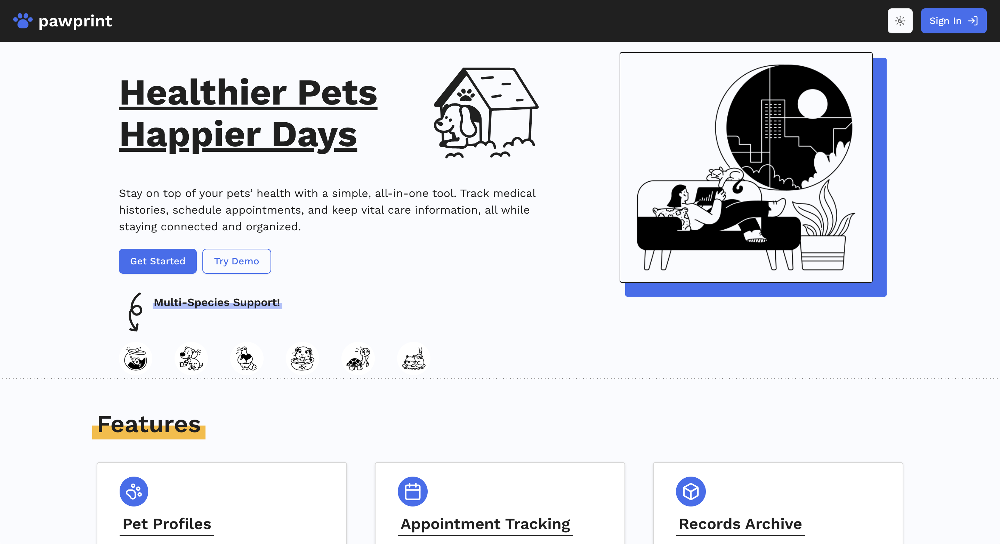

# pawprint

A tool for pet owners to manage anything & everything about their furry (or feathered or scaled) friends! 🐶🐱🦜🐟

Built with [Next.js](https://nextjs.org/) & [Supabase](https://supabase.com/), styled with [Tailwind CSS](https://tailwindcss.com/) & [shadcn/ui](https://ui.shadcn.com/), and deployed on [Vercel](https://vercel.com/).

[Check it out!](https://paw-print-kappa.vercel.app/) - Click `Try Demo` to log in with a sample account (no registration required)  
 

## Features
A quick look at what pawprint can do:
- **Individual Pet Profiles** - Whether you have 1 or 100 pets, streamline care by tracking medications, health records, conditions, allergies and more all in one place 
- **Interactive Calendar** - Stay on top of daily routines and scheduled appointments by tracking them with the calendar feature and receiving regular reminders
- **Personal Archive** - Stay organized by securely storing and retrieving any number of files or contacts tied to your pets' care history
- **Collaborative Care** - Ensure your pets receive the best possible care by sharing routines, notes, or files with family, caretakers, or vets with ease 
